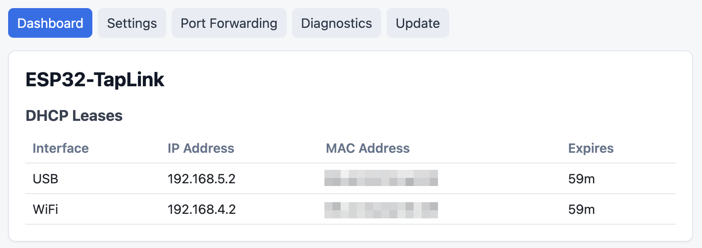
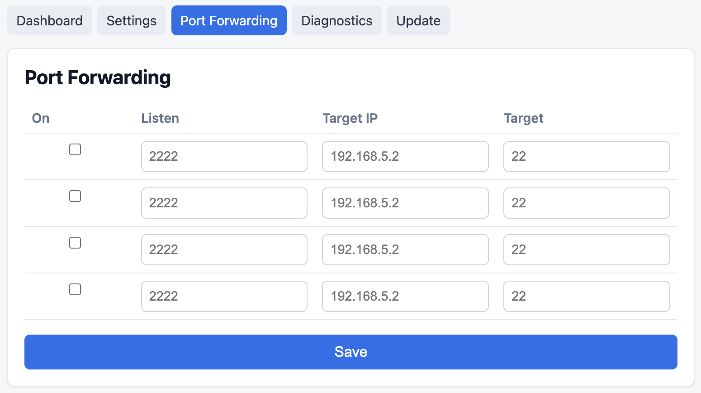

# ESP32-TapLink

[](https://github.com/davidliyutong/esp32-taplink/actions/workflows/build-firmware.yml)


Pocket-sized out-of-band WiFi access for headless servers and workstations. Plug ESP32-TapLink into a server's USB port and it appears as a standard CDC-NCM USB Ethernet adapter; the device runs its own WiFi access point and routes IP traffic between USB and WiFi, so you can SSH into the host from a laptop or phone even when the primary network is down. A low-cost, userland alternative to IPMI/BMC for machines without lights-out management.

```
┌─────────────────────┐   USB NCM    ┌───────────┐   WiFi AP    ┌──────────────────┐
│  Headless server /  │─────────────▶│  ESP32-S3 │◀─────────────│  Laptop / phone  │
│     workstation     │ 192.168.5.0  │  (router) │ 192.168.4.0  │      (SSH)       │
└─────────────────────┘    /24       └───────────┘    /24       └──────────────────┘
```

## Use cases

- **Recover a headless server when the LAN is down** — SSH in over the ESP32's own WiFi AP without touching the upstream network.
- **First-boot setup for workstations, NAS, or appliances** — assign an IP over USB, run the installer or reach the web UI, then unplug when the box is on the network.
- **Cheap post-boot OOB for hardware without IPMI / iDRAC / iLO / AMT** — useful for desktop CPUs, Mini-PCs, and SBCs that lack lights-out management.

> Scope: this is **post-boot / userland** out-of-band access — the host OS must be running with USB CDC-NCM drivers loaded (default on macOS, Linux, and Windows 10+). It does not provide power control, KVM video, or pre-boot/BIOS access.

## Screenshots





## Features

- **USB NCM gadget** — driverless on macOS/Linux, standard CDC-NCM on Windows
- **WiFi SoftAP** — configurable SSID, password, channel, TX power
- **Dual-subnet DHCP** — independent pools for USB and WiFi sides
- **IP forwarding** — lwIP-based L3 routing between subnets with static route injection via DHCP options (classless + Microsoft)
- **Port forwarding** — up to 4 TCP rules (e.g. expose a USB-side service to WiFi clients)
- **Web management** — dashboard with DHCP lease table, settings page for WiFi/network/admin config, Basic Auth
- **NVS persistence** — all config survives reboot; factory reset via 5 s button hold (GPIO 0)
- **LED status** — GPIO 21 blink rate indicates boot / USB connected / idle

## Limitations

> **This is NOT a Layer-2 bridge.**

The firmware does **not** perform transparent L2 frame bridging. USB and WiFi interfaces live on separate IP subnets, and traffic between them is routed at L3 via `CONFIG_LWIP_IP_FORWARD`. This means:

- Broadcast/multicast traffic (mDNS, ARP, SSDP, DLNA …) does **not** cross between USB and WiFi — devices on different sides cannot discover each other via link-local protocols.
- Protocols that rely on being on the same L2 segment (e.g. Wake-on-LAN, certain IoT pairing flows) will not work across the boundary.
- The ESP32 WiFi driver does not support 802.11 4-address (WDS) frames, which would be required for true transparent L2 bridging of arbitrary MACs through a SoftAP.

For most use cases — letting a USB host reach WiFi clients, or letting WiFi clients reach USB-side services — L3 routing works fine. Just be aware that the two sides are distinct broadcast domains.

## Quick Start

```bash
# 1. Clone and install toolchain (one-time)
git clone https://github.com/davidliyutong/esp32-taplink.git
cd esp32-taplink
make setup    # clones ESP-IDF v5.5.3 + installs toolchain into .esp-idf/
make init     # sets target to esp32s3

# 2. Build and flash
make build
make flash          # or: make flash-monitor
```

After flashing, plug ESP32-TapLink into the target server's USB port — the host gets an IP in `192.168.5.0/24` via DHCP-over-USB. From your laptop or phone, join the WiFi AP (default SSID `ESP32-TapLink`, password `12345678`, which puts you on `192.168.4.0/24`) and SSH into the server:

```bash
ssh user@192.168.5.2    # first DHCP lease on the USB side
```

Traffic is routed at L3 from WiFi to USB by the ESP32. The web UI is at `http://192.168.5.1` (USB side) or `http://192.168.4.1` (WiFi side); default Basic Auth credentials are `admin` / `admin`.

## Build Commands

| Command | Description |
|---|---|
| `make setup` | Clone ESP-IDF + install toolchain |
| `make init` | Set target to `esp32s3` |
| `make build` | Compile firmware |
| `make flash` | Flash to connected device |
| `make monitor` | Serial monitor (`Ctrl-]` to quit) |
| `make flash-monitor` | Flash then monitor |
| `make menuconfig` | Interactive Kconfig editor |
| `make clean` | Incremental clean |
| `make fullclean` | Remove entire build directory |
| `make format` | `clang-format` all `main/` sources |
| `make lint` | `clang-tidy` (needs prior build) |

## Architecture

```
app_main
  ├─ nvs_config     — load/save taplink_config_t from NVS
  ├─ usb_ncm        — TinyUSB NCM device, esp_netif driver interface
  ├─ wifi_ap         — SoftAP with auto-restart and station tracking
  ├─ router          — dual-subnet DHCP servers, IP forwarding, route injection
  ├─ port_forward    — TCP port-forwarding rules (lwIP raw API)
  └─ web_server      — HTTP/80, dashboard + config pages, Basic Auth
```

Config changes via the web UI are saved with `config_save()` and then redirect to a reboot-required page. Press the Reboot button to restart the device and apply the changes; there is no hot-reconfigure path.

## Hardware

| Item | Detail |
|---|---|
| MCU | ESP32-S3 (native USB-OTG) |
| LED | GPIO 21 |
| Button | GPIO 0 (boot button, factory reset on 5 s hold) |

Firmware version is derived from `git describe --tags` at CMake configure time.

---

<sub>**Keywords:** out-of-band management, OOB, post-boot OOB, IPMI alternative, BMC alternative, headless server, headless workstation, remote SSH over WiFi, USB Ethernet gadget, USB-to-WiFi bridge, ESP32-S3, TinyUSB NCM, CDC-NCM, homelab, datacenter, console server, server recovery, crash cart, lights-out.</sub>
